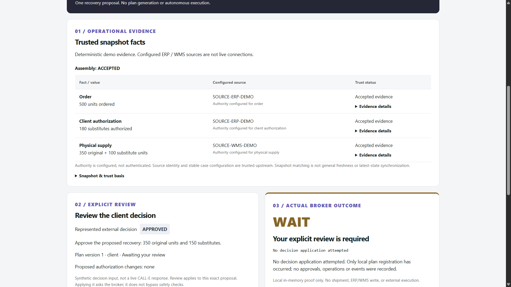
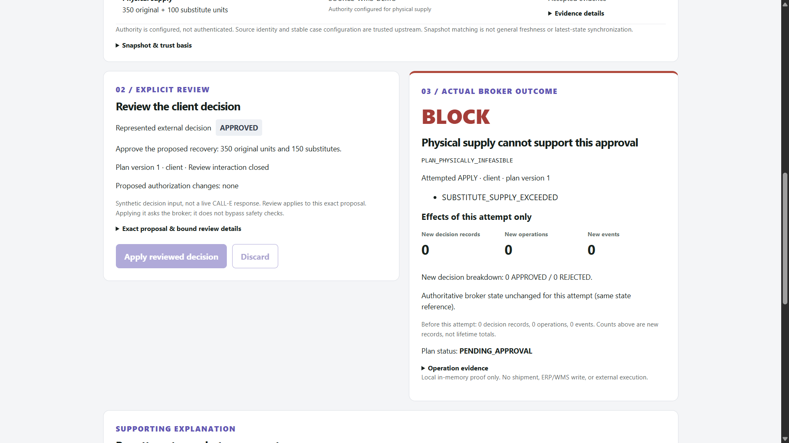

# Exception Broker

**A successful AI interaction is not authority to execute.**

Exception Broker is an execution-control layer that separates AI-acquired decisions from authority to change operational state.

The current browser proof is deterministic and local: its decisions are explicit synthetic inputs, not AI-generated or CALL-E-generated results. The shortage scenario demonstrates the boundary; it does not define the entire product category.

## The represented decision is APPROVED. The broker still blocks its application.

| H02 input | Value |
|---|---:|
| Represented decision | **APPROVED** |
| Proposed substitutes | **150** |
| Client authorization limit | **180** |
| Physical substitute supply | **100** |

Authorization is sufficient. Modeled physical supply is not.

After explicit bound review, the broker attempts local application through the existing executor/Decision Application path and returns **BLOCK**:

`PLAN_PHYSICALLY_INFEASIBLE` · `SUBSTITUTE_SUPPLY_EXCEEDED`

**This blocked application attempt creates zero new decision, operation, or event records and preserves the exact pre-attempt state.** The proposal remains unapproved. These are assertions against the real local execution boundary, not a frontend-only BLOCK label. [Inspect the H02 proof and its zero-effects assertions](tests/application/productProofV2.heterogeneousEvidence.test.ts).

This demonstration uses configured evidence and synthetic decisions. It performs no shipment, ERP/WMS write, or external operational execution.

**CALL-E is separately proven live:** productized Operator Sandbox runs reached both a normalized clarification safe-stop and an exact reviewed APPROVED path that applied local sandbox effects. These historical runs did not generate H01/H02/H03, and no external operation was executed. The two evidence lanes below keep those claims distinct.

## One boundary, three independent proofs

| Scenario | Evidence condition | Local outcome | What it establishes |
|---|---|---|---|
| **H02 — BLOCK** | 150 substitutes proposed; 180 authorized; 100 available | Reviewed APPROVED decision blocked; zero new effects | Agreement and authorization do not create physical supply |
| **H01 — ALLOW** | Sufficient modeled supply and required bound reviews | Exact local plan-lineage finalization | Supportable recovery can proceed; the broker does not merely block everything |
| **H03 — WAIT** | Authoritative physical-supply claims conflict | No trusted case, registration, review, or application | Uncertain operational truth is not silently converted into actionable state |

The scenarios are independent. **H01 does not repair H02.** They share the same core recovery intent while changing the physical evidence condition. H01 requires separate Client, Production, and Supplier reviews; partial approval is not final recovery authorization.

The UI's formal, physical, and currentness explanations are read-only snapshot assessments, **not chronological gate telemetry**. H03 stops earlier, at evidence assembly; it does not fabricate a case to claim physical infeasibility. Product Proof v2 also tests missing physical evidence, beyond the browser's conflicting-evidence example.

## CALL-E: two evidence lanes

### Lane A — Historical live acquisition

Real CALL-E provider interactions and completed tasks were observed through the productized Operator Sandbox:

- **Operator Run 1 / `OPERATOR-LIVE-V1`:** schema-valid `NEEDS_CLARIFICATION` → mapper and Bridge accepted → clarification stop → zero new effects.
- **Operator Run 2 / `OPERATOR-LIVE-V2`:** schema-valid `APPROVED` → exact retained proposal displayed → explicit human `APPLY` → current local Broker/Application evaluation → `ALLOW` / `LINEAGE_RESOLVED` → one local decision, operation, and event record.

These are operator-observed historical results; no original CALL-E recording is bundled. Reviewer identity was local and unauthenticated, lifecycle timestamps came from the unattested local process clock, state and effects were in memory, and Supplier/Production setup records were synthetic. Historical CALL-E calls did not generate H01/H02/H03. See the [live validation evidence note](docs/evidence/call-e-live-validation.md).

The [CALL-E provider](src/integrations/calle/callEProvider.ts) invokes the SDK's `calls.createAndWait`; the existing mapper and Bridge handle the returned decision evidence. A completed provider task is not itself a usable decision, and a usable decision is not itself permission to apply it.

### Lane B — Deterministic execution-control proof

H01/H02 use synthetic normalized decisions with the real Bridge, explicit bound review, and executor/Application. H03 never reaches that decision path. This lane demonstrates local ALLOW/BLOCK/WAIT behavior independently of live acquisition.

## H02: inputs and blocked application

These are two genuine localhost captures from the same deterministic H02 scenario. They are not historical CALL-E evidence. Open either image at full size to inspect the text.



*H02 — deterministic inputs before application. The represented decision is APPROVED; 150 substitutes are proposed, 180 are authorized, but only 100 are physically available. Configured ERP/WMS sources are not live integrations.*



*H02 — after the reviewed local application attempt. The broker returns BLOCK with PLAN_PHYSICALLY_INFEASIBLE / SUBSTITUTE_SUPPLY_EXCEEDED, creates zero new decision, operation, or event records, and preserves the pre-attempt broker state.*

## Responsibility boundaries

This is a structural map of responsibilities and demonstrated endpoints, not an execution log. Historical live application affected local sandbox state only.

```text
HISTORICAL LIVE ACQUISITION PROOF
CALL-E -> mapper -> Bridge -> clarification STOP; zero effects (Operator Run 1 / V1)
CALL-E -> mapper -> Bridge -> exact review/APPLY -> local Application -> ALLOW (Operator Run 2 / V2)

DETERMINISTIC EXECUTION-CONTROL PROOF
Configured evidence -> Evidence Boundary -> trusted local case
                             | conflict
                             +-----------> WAIT; no case (H03)
Explicit planner proposal ----------------> plan registration
Synthetic decision -> Bridge -> explicit bound review
                                    |
Trusted local case + registered plan + reviewed proposal
                                    |
                         executor / Decision Application
                                    |
                        local ALLOW (H01) / BLOCK (H02)
```

Evidence assembly establishes which supplied facts may enter trusted state under the configured policy. It does not approve a plan. Plan registration records an explicit proposal; acceptance there does not mean approvability. Decision Application remains responsible for the applicable action controls, and the executor reports exact local outcomes and effects.

## More than approval routing

The distinction is behavioral: H02's reviewed APPROVED decision still fails because modeled physical evidence cannot support it. F-04 binds review to exact proposal semantics: **Review A cannot authorize Proposal B**. Exact plan/version and lineage checks reject superseded decisions; predecessor approvals cannot authorize a successor.

Authorization is checked separately from availability. An authorization change does not automatically create supply, a successor, or approval. Supported replay/idempotency protections reject reused operation/approval identities rather than creating a second business effect. H03 stops before trusted-state construction, while H01 proves liveness through the same local controls.

Workflow products can implement controls too. This repository's evidence is that these execution-control boundaries are explicit and independently tested—not that other products cannot implement them. Inspect the linked assertions rather than interpreting a successful operation as universal safety or final authorization.

## Reproduce the proof

Use Node.js `^20.19.0` or `>=22.12.0`, with npm. Install the lockfile dependencies, run the suite, then start the browser app:

```sh
npm ci
npm test
npm run dev
```

`npm ci` requires normal package-registry access. Once installed, the deterministic proof needs no CALL-E credentials or paid service. Ordinary `npm test` skips the manually gated live CALL-E test. Open the Local URL printed by Vite.

1. **H02 starts selected.** Inspect 150/180/100 and the represented decision. Select **Apply reviewed decision**. Expect `PLAN_PHYSICALLY_INFEASIBLE`, `SUBSTITUTE_SUPPLY_EXCEEDED`, zero new effects, and exact state preservation.
2. **Select H01 independently.** Apply the Client, Production, and Supplier reviews separately. Expect WAIT before the final required review, then local ALLOW / `LINEAGE_RESOLVED` for the exact plan lineage.
3. **Select H03.** Expect conflicting unaccepted claims and WAIT, without a review/application action. Resetting or switching scenarios starts independent state.

Expand proposal and operation details to inspect identities. **Discard** uses the bound review path without applying the decision; it is not a business-safety BLOCK. All displayed effects belong to the local demonstration.

Run just the heterogeneous-evidence proof:

```sh
npm test -- tests/application/productProofV2.heterogeneousEvidence.test.ts
```

Additional repository checks:

```sh
npm run typecheck
npm run build
git diff --check
```

The manual live harness is an operator tool, not part of this quickstart. Its dedicated test selection, exact mode/confirmation gates, credentials, and post-result review are separate requirements. A harness filename is not proof that every live stage occurred.

## Offline Operator Sandbox

Run `npm run operator:sandbox` for a separate interactive terminal workflow. Type `ACQUIRE` to obtain a deterministic MockProvider response, inspect the complete exact review, then choose `APPLY` or `DISCARD`. Missing or unrecognized confirmation never applies a decision. V1 accepts no flags or live mode and reads no CALL-E credentials.

`npm run operator:sandbox:live` is a separate deliberately gated composition limited in source code to CALL-E's official testing hotline. It requires an interactive terminal, exact `LIVE` acknowledgement, inspection of a deeply frozen request with a fresh acquisition ID, and exact acquisition-specific confirmation before `CALLE_API_KEY` is read. It permits one call attempt per session, has no retry or destination override, and accepts no command-line arguments. Two operator-observed live validations are recorded in the [live evidence note](docs/evidence/call-e-live-validation.md): V1 stopped safely for clarification; V2 displayed an exact APPROVED proposal for explicit review and, after `APPLY`, produced local `ALLOW` / `LINEAGE_RESOLVED` effects.

Both commands use synthetic, pre-trusted operational state that is not assembled through Evidence Boundary or connected to ERP/WMS. Supplier/Production setup approvals are explicitly synthetic. Offline acquisition is mock data; live composition can make only one deliberate CALL-E acquisition. Both reuse the same mapping, Bridge, bound review and local executor/Application. Reviewer identity is not authenticated, state and acquisition receipt are in-memory, and no shipment or external fulfillment occurs. Output distinguishes prior setup records from new effects.

The reusable session coordinator accepts a `CallProvider`, permits one acquisition attempt per session, and never retries or automatically applies. Each live request definition is explicitly versioned while each acquisition receives a separate fresh identity. There is no persistent request registry. The browser Proof UX and historical manual live CALL-E harness remain separate from the productized Operator Sandbox evidence.

## Claim-to-evidence index

| Claim / boundary | Inspect |
|---|---|
| H01/H02/H03 and frozen causal comparison | [Product Proof v2](tests/application/productProofV2.heterogeneousEvidence.test.ts) |
| UI outcomes come from real local review/application | [Proof UX tests](tests/ui/ProofExperience.test.tsx), [demo adapter tests](tests/demo/proofDemo.test.ts) |
| Exact review binding, authorization, rejection and idempotency | [Decision Application / F-04 tests](tests/integrations/calle/decisionApplication.test.ts) |
| Twelve named safety and liveness scenarios | [Product Proof Benchmark v1](tests/application/productProofBenchmark.v1.test.ts) |
| Frozen unseen CASE-005 composition | [Unseen challenge](tests/application/adaptiveOrchestrator.unseenChallenge.test.ts) |
| Authority, provenance, effective instant, missing/conflicting evidence | [Evidence Boundary tests](tests/application/evidenceBoundary.test.ts), [implementation](src/application/evidenceBoundary.ts) |
| Physical supply is not authorization | [Physical Feasibility tests](tests/domain/physicalFeasibility.test.ts) |
| Explicit actions, scoped resolution, failure-state preservation | [Adaptive executor tests](tests/application/adaptiveOrchestrator.test.ts), [implementation](src/application/adaptiveOrchestrator.ts) |
| CALL-E request construction, normalization and context checks—offline tests | [Provider](tests/integrations/calle/callEProvider.test.ts), [mapper](tests/integrations/calle/mapper.test.ts), [Bridge](tests/integrations/calle/decisionBridge.test.ts) |
| Productized live Operator Sandbox implementation and network-free tests | [Live composition](scripts/operator-sandbox-live.ts), [live composition tests](tests/operator/operatorSandboxLive.test.ts) |
| Operator-observed productized CALL-E live results and limits | [Live validation evidence note](docs/evidence/call-e-live-validation.md) |
| Historical manually gated live procedure and sanitized stage reporting | [Manual live harness](tests/integrations/calle/calleLiveEndToEndProof.manual.test.ts) |

Benchmarks establish their named scenarios, not production reliability statistics or universal generalization. CASE-001 remains retained legacy simulation proof, not the default UI or a required generalized sequence. Live-run observations and deterministic test results are different evidence classes.

## Proof limits

Configured ERP/WMS labels are not live integrations. Declared source identity and stable configuration are trusted upstream; the broker does not independently authenticate those systems or people. Plan-lineage currentness is not general evidence freshness or latest-inventory synchronization.

Records are inspectable local decision, operation, and event data—not persistent or tamper-evident audit storage. The proof does not demonstrate external shipment/order execution, production reliability, multichannel resilience, cryptographic acquisition-attempt provenance, or universal safety. Live `REJECTED` application remains outside the demonstrated CALL-E evidence; the observed live `APPROVED` application produced local sandbox effects only.

## Commercial direction

The demonstrated wedge is locally controlled Supplier/Production/Client recovery with separately supplied authority and operational evidence. The broader direction is operational exception execution control where facts and authority are distributed across systems and parties: **obtaining agreement does not establish that an action is operationally supportable**.

The shortage is a proof vehicle for that boundary, not the whole product category. Enterprise deployment would still require real adapters, upstream authentication, durable records and lifecycle controls, and operational hardening. No customer validation, deployment, adoption, revenue, or ROI claim is made here.
